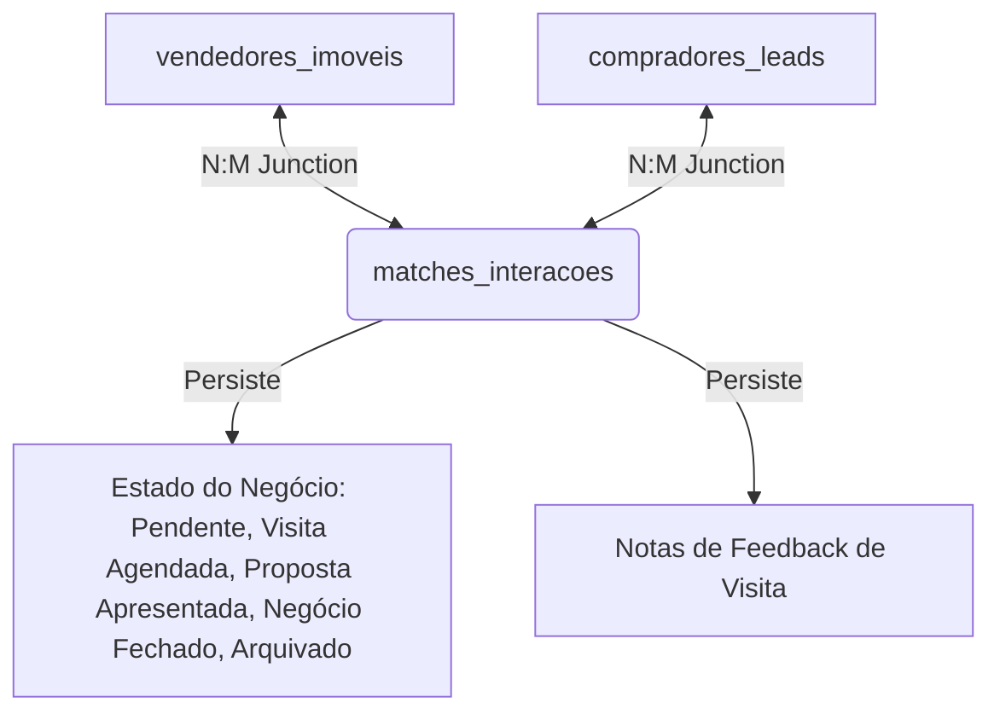

# Descobertas e Decisões Técnicas (findings.md)

Este documento regista a arquitetura do sistema, modelação de base de dados e decisões técnicas tomadas para o desenvolvimento do Dashboard Imobiliário.

---

## 🏛️ 1. Arquitetura do CRM de Interações (Novidade)

Adicionámos uma tabela de junção `matches_interacoes` para servir de base ao CRM de visitas e propostas:

### Decisão Técnica: Upsert de Estado
Para evitar criar interações de forma preventiva para todos os cruzamentos possíveis, a tabela `matches_interacoes` apenas recebe registos quando o utilizador altera manualmente o estado de um match ou edita notas. A View SQL utiliza um `LEFT JOIN` com `COALESCE` para garantir que matches sem interações gravadas apareçam com o estado padrão `'Pendente'`.

---

## 🔑 2. Filtragem Rígida por Tipo de Imóvel (Moradia, Apartamento, Terreno)

### Atualização do Esquema
1. **`vendedores_imoveis.tipo_imovel` (Text)**: Regista se o imóvel é um Apartamento, Moradia, Terreno Agrícola ou Terreno para Construção.
2. **`compradores_leads.tipos_imovel_pretendidos` (Text[])**: Regista a lista de tipos de imóvel procurados (ex: permite procurar em simultâneo por Apartamento e Moradia).

### Lógica de Matching
A view de matching foi expandida com o seguinte filtro rígido:
`i.tipo_imovel = any(c.tipos_imovel_pretendidos)`
Garante que um comprador que procura exclusivamente terrenos agrícolas nunca receberá propostas de apartamentos.

---

## ⚙️ 3. Ferramentas e Frameworks Propostos

- **Frontend**: Vite + React + TypeScript.
- **Estilo**: CSS Vanilla moderno (variáveis CSS, Grid, Flexbox e animações).
- **Ícones**: `lucide-react`.
- **Base de Dados**: Supabase (PostgreSQL nativo).
